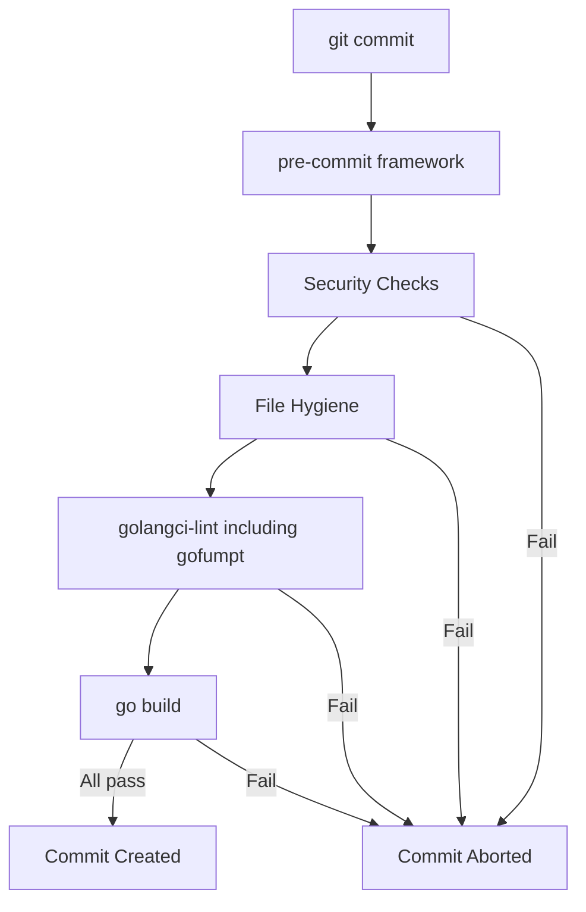

# Pre-commit Hook Setup

## Tools

- **[pre-commit](https://pre-commit.com/)** - Framework for managing git hooks
- **[golangci-lint](https://golangci-lint.run/)** - Go linters aggregator (includes 100+ linters: govet, staticcheck, errcheck, gosimple, ineffassign, etc.)

## Checks to Include

### 1. Go Linting (golangci-lint)

- Runs all enabled linters in parallel (much faster than individual tools)
- Enabled linters: govet, errcheck, staticcheck, gosimple, ineffassign, unused, gofumpt
- Can enable additional linters via config

### 2. Go Formatting

- **gofumpt** - Stricter Go formatting (superset of gofmt with additional rules)
- Enabled via golangci-lint's `gofumpt` linter

### 3. Go Build

- Ensure all modules compile

### 4. Security Checks (built-in pre-commit hooks)

- **detect-aws-credentials** - Block AWS access keys
- **detect-private-key** - Block private keys
- **check-added-large-files** - Prevent large binaries

### 5. File Hygiene

- **end-of-file-fixer** - Ensure files end with newline
- **trailing-whitespace** - Remove trailing whitespace
- **check-yaml** - Validate YAML files
- **check-json** - Validate JSON files

## Files to Create

- [.pre-commit-config.yaml](../.pre-commit-config.yaml) - Pre-commit hook configuration
- [.golangci.yml](../.golangci.yml) - Golangci-lint configuration (optional but recommended)

## Installation

```bash
# Install pre-commit (macOS)
brew install pre-commit

# Install golangci-lint
brew install golangci-lint

# Install gofumpt (for auto-fixing)
go install mvdan.cc/gofumpt@latest

# Install hooks in repo
pre-commit install
```

## Usage

- Normal commit: `git commit` - runs all hooks automatically
- Run manually: `pre-commit run --all-files`
- Skip hook: `git commit --no-verify` - bypass for emergencies

## Flow


